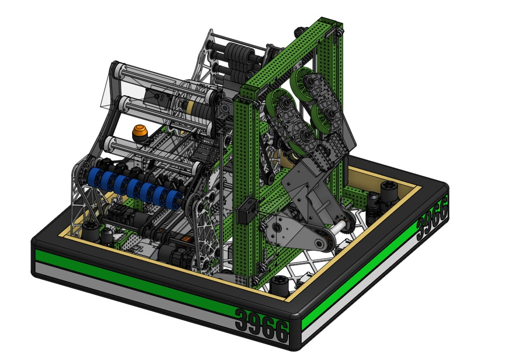

# West Coast Products CADathon: Hero Heist

[Home](README.md) | [Robotics](Robotics.md) | [ORNL Internship 1](ORNL1.md) | [ORNL Internship 2](ORNL2.md) | [Tetris AI](TetrisAI.md) | [WCP CADathon](CADathon.md)

## Problem:  
How can a competitive robot be designed under extreme time constraints for a newly released game with no prior iteration?

<!--
Source - https://stackoverflow.com/a    
Posted by Viper
Retrieved 2026-01-04, License - CC BY-SA 3.0
-->

## Context
- West Coast Products CADathon: *Hero Heist*  
- 1-week rapid design challenge  
- 3-student team  
- Team-based engineering competition  
- Role: Strategy analysis, simulation specialist

In this event, West Coast Products released a brand-new theoretical game and required teams to CAD a complete robot concept in one week to allow teams to build design skills and to search for potential teams to sponsor. The rules reward mechanical feasibility and clear documentation.

## Technical Challenges:
- No opportunity for prototyping or iteration  
- Ambiguous game dynamics requiring early strategic decision-making  
- Balancing mechanical complexity with feasability  
- Translating strategy ideas into a cohesive mechanical system under time pressure  

## My Contributions
- Analyzed game rules to identify high-value scoring objectives and constraints  
- Helped define system requirements based on strategic priorities  
- Designed and modeled simulated versions of subsystems to quickly test ideas
- Contributed to documentation explaining major design tradeoffs and assumptions  

## Tools & Methods
- Onshape CAD  
- Unity for game simulation  
- Strategic game analysis  
- Rapid mechanical design principles  
- Design tradeoff evaluation and constraint analysis  

## Results
- Completed a full robot design within the 1 week timeframe  
- Produced a cohesive CAD model aligned with strategic goals  
- Created documentation detailing system architecture and design    
- Demonstrated the ability to move from abstract game analysis to concrete mechanical design under strict time constraints  

## Reflection
With limited time and incomplete information, I learned to favor simplicity, robustness, and clear assumptions over theoretically optimal designs, which is an approach directly applicable to real-world engineering environments when feasability comes into question.  

[Design Documentation PDF](https://drive.google.com/file/d/1qHplBDfvMUsecHx0ko41gLbZD6nvemOZ/view?usp=sharing)  
[Onshape CAD Model](https://cad.onshape.com/documents/897f8e8e96af0a1741ef0e6f/w/0cb92fccb134b29143ce9185/e/239881dbf42e43032abc7fed)
[WCP CADathon 2025 Game Manual](https://docs.google.com/document/d/1nNpAchUD-hpe1uz8j9genUILXjWeNt5UqWTSC6C7gyg/edit?tab=t.0)