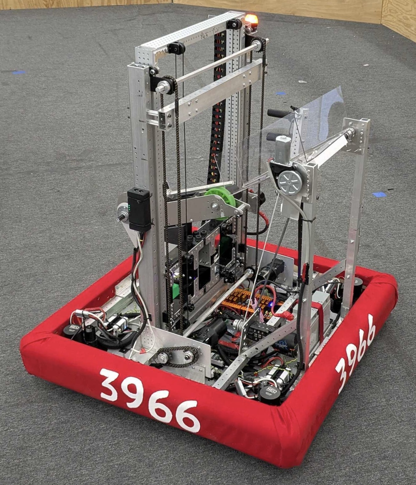

# FIRST Robotics Team 3966: Driver & Lead Programmer

[Home](README.md) | [Robotics](Robotics.md) | [ORNL Internship 2](ORNL2.md) | [Tetris AI](TetrisAI.md)

**Problem:** Design and operate a competitive FRC robot capable of performing reliably under pressure throughout the season.

**Context:**  
- Team 3966, FIRST Robotics Competition  
- Season: 2025  
- Team size: ~50  
- Role: Primary driver, lead programmer, systems integrator

**Technical Challenge:**  
Developing control systems that could handle dynamic competition conditions while coordinating with a larger software team. The robot required precise timing, rapid decision-making, and modular programming to adapt to different game challenges.

**My Contributions:**  
- Implemented core robot control logic, including shooter and turret system simulations for future team use 
- Performed 150+ Git commits to refine and optimize code over the season  
- Acted as primary driver, making split-second decisions that guided the team to Regional Finals 

**Tools & Methods:**  
- Java & WPILib for robot programming  
- Git version control  
- PID control systems and real-time feedback loops

**Results:**  
- Helped improve team ranking from outside the top 2600 worldwide to nearly top 600 in a single season
- Regional Finals appearance  
- Created modular template code for future robots to facilitate team onboarding

**Reflection:**  
This experience taught me the importance of integrating software and hardware under real-world constraints. Driving the robot informed how I approached programming decisions, highlighting the connection between human factors and control system design.

[GitHub Repository 2025](https://github.com/gryphoncommand/2025Code)  
[Practice Match 360° Camera Video](https://drive.google.com/file/d/1TfkAZb85JJiTLHGDsv8WiVBUcLH-XIGa/view?usp=sharing)
